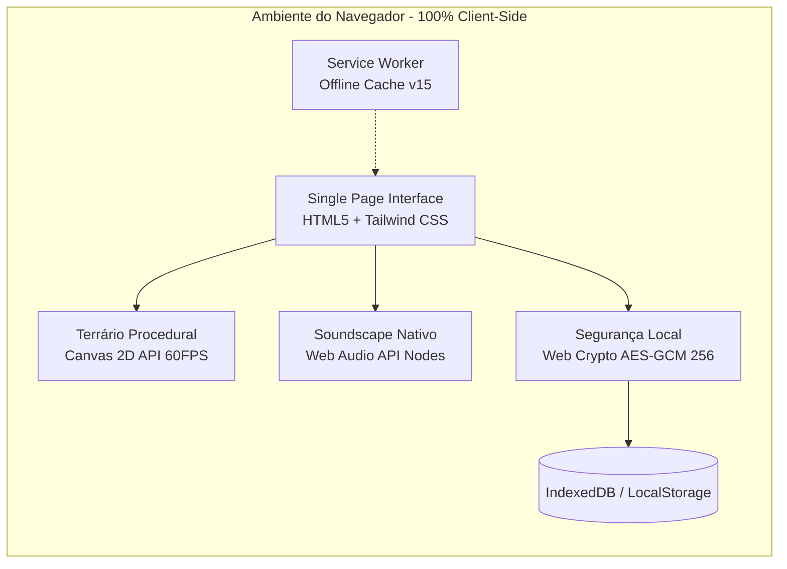

<div align="center">

# 🌿 Respiro

### Ativação Comportamental Adaptativa & Neuroergonomia Sensorial
**Uma Single Page Application (PWA) 100% offline-first, privada e acolhedora, desenhada para momentos de sobrecarga mental, depressão profunda e ansiedade.**

<br/>

[](https://github.com)
[](https://github.com)
[](https://github.com)
[](https://github.com)
[](LICENSE)

<br/>

*“Seu valor não diminui com o seu cansaço.”*

</div>

---

## 🧭 Sobre o Projeto

A maioria dos aplicativos de produtividade e hábitos foi desenhada para pessoas com alta energia executiva. Eles usam **notificações invasivas**, **contadores de ofensiva (streaks) punitivos** e **metas irreais** que geram culpa e paralisia quando a pessoa está enfrentando episódios depressivos ou crises de ansiedade.

O **Respiro** propõe uma inversão completa:
- **Zero cobrança ou culpa:** O app nunca cobra se você passar dias sem abri-lo. Não há calendários com buracos vermelhos.
- **Microativação fractal:** Tarefas atômicas (como *"beber um gole d'água"* ou *"soltar os ombros"*). Se ainda assim for difícil, o app quebra a ação em uma versão ainda mais suave.
- **Adaptação Somática Dual:**
  - **Modo Sem Energia (Hipoativação / Depressão):** Ritmo brando, conservação de energia e quebra gradual da inércia.
  - **Modo Mente Acelerada (Hiperativação / Ansiedade):** Desaceleração simpática, estímulo vagal, respiração cadenciada e ancoragem física imediata.
- **Privacidade Radical (Local-Only):** Nenhum dado sai do seu aparelho. Sem login obrigatório, sem servidores externos, com opção de criptografia local AES-GCM de 256 bits via PIN.

---

## 📊 Paradigma: Produtividade Punitiva vs. Respiro

| Característica | Apps Tradicionais de Hábitos | O Respiro |
| :--- | :--- | :--- |
| **Mecânica de Dias Parados** | Streaks quebram $\rightarrow$ frustração e culpa | **Trilha de Pedras**: cada passo é um marco eterno |
| **Reação ao Cansaço** | Alertas urgentes e notificações push | **Modo Espectador**: *"Só abri o app hoje"* já é uma vitória |
| **Volume Sensorial** | Cores saturadas, sons estridentes, pop-ups | **Estímulo Zero**: tipografia sutil, luz zenital e silêncio |
| **Paisagem Sonora** | Arquivos MP3 pesados ou streaming externo | **Síntese Algorítmica**: Web Audio API pura sem tráfego |
| **Privacidade** | Coleta de telemetria e login na nuvem | **100% no Dispositivo**: IndexedDB + Web Crypto local |

---

## 🏛️ Fluxo de Ativação Comportamental

O gráfico abaixo ilustra como o motor do Respiro processa os estados fisiológicos e orienta a pessoa com suavidade:


---

## ✨ Recursos de Destaque

### 1. 🪟 Ergonomia Sensorial & Design Zenital
- **Curvaturas Contínuas (Squircle):** Harmonia geométrica aninhada (`rounded-3xl` externo com `rounded-xl` interno).
- **Luz Zenital (`.zenith-card`):** Bordas com gradiente fosco mineral translúcido (`rgba(255, 255, 255, 0.07)`), proporcionando alívio visual em quartos escuros.
- **Modo Estímulo Zero:** Um botão para ocultar qualquer componente secundário, deixando na tela apenas uma frase suave e duas escolhas.
- **Tipografia Display Maternada:** Família serifada *Fraunces* com tracking negativo e entrelinhas relaxadas em cinza mineral cálido (`#a1a1aa`), eliminando o branco agressivo.

### 2. 🌱 O Terrário Vivo Procedural (HTML5 Canvas)
- **Simulação Circadiana em Tempo Real:**
  - **Dia:** Raios solares filtrados pelas folhagens (*god rays* dourados e esmeraldas).
  - **Crepúsculo:** Luz horizontal âmbar e atmosfera morna de desaceleração.
  - **Noite:** Penumbra suave, reflexos prateados e vaga-lumes bioluminescentes pulsando harmonicamente.
- **Interação Contemplativa:** Brisa suave reativa ao movimento do cursor/toque (*leaf sway*), auréolas de luz translúcida e gotas de orvalho que caem com física suave e microvibração háptica.
- **Coleção Silenciosa:** Elementos como *Ramo de Alfazema*, *Pedra de Rio*, *Cogumelo Luminescente*, *Folha de Ginkgo*, *Broto de Sálvia* e *Cristal de Orvalho*.

### 3. 🌧️ Soundscape Sintetizado Nativamente (Web Audio API)
Zero dependência de arquivos de áudio externos ou conexão de rede:
- **Ruído Marrom Puro:** Filtragem de ruído branco para alívio neurovegetativo e cancelamento de sobrecarga sonora.
- **Chuva Mansa:** Filtros passa-faixa estocásticos que mimetizam gotas d'água caindo em folhas.
- **Brisa Noturna:** Modulação de baixa frequência (LFO de 0.15Hz) criando ondulações de ar suave.

### 4. 🫁 Guia de Respiração Descompressiva (Tela Cheia)
- Interface desprovida de cronômetros regressivos ou números indutores de ansiedade.
- Expansão e contração de um círculo amplo orgânico acompanhado de halos de luz difusa para ancorar a atenção no corpo.
- Toque em qualquer lugar da tela para fechar instantaneamente.

### 5. 🛡️ Segurança, Criptografia & Terapia
- **Criptografia AES-GCM (256 bits):** Proteção ponta a ponta dos seus registros através da Web Crypto API do próprio navegador.
- **Relatório de Apoio para Sessão de Terapia:** Gerador de relatório formatado para impressão ou PDF com médias de humor, nível de conservação de energia e âncoras de alívio, facilitando o diálogo com psicólogos e psiquiatras.
- **Exportação Rápida de Cartão do Dia:** Formatação limpa em texto pronto para enviar via WhatsApp para familiares ou terapeutas.

---

## 🛠️ Arquitetura Técnica



- **Linguagens:** HTML5 semântico, Modern JavaScript (ES6+ modular e reativo) e Tailwind CSS.
- **PWA Ready:** Manifest configurado, ícone vetorial adaptativo e Service Worker com estratégia *Cache-First* garantindo execução completa sem internet.
- **Dependências Externas:** Zero frameworks pesados (sem React, Vue ou Angular). Carregamento instantâneo de ~0.3s.

---

## 🚀 Como Executar Localmente

Como o projeto é construído em tecnologia web nativa sem necessidade de etapa de compilação (*build step*):

1. **Clone o repositório:**
   ```bash
   git clone https://github.com/SEU-USUARIO/respiro.git
   cd respiro
   ```

2. **Abra diretamente no navegador:**
   - Dê um duplo clique no arquivo `index.html`, ou
   - Use uma extensão como *Live Server* no VSCode, ou
   - Use qualquer servidor HTTP simples:
     ```bash
     # Usando Python
     python -m http.server 8080
     
     # Ou usando Node.js
     npx serve .
     ```

3. Acesse `http://localhost:8080` no navegador do celular ou computador.

---

## 🌐 Publicando no GitHub Pages (Grátis e Imediato)

Você pode disponibilizar seu Respiro online publicamente no GitHub Pages em menos de 1 minuto:

1. No seu repositório no GitHub, clique na aba **Settings** (Configurações).
2. No menu lateral esquerdo, clique em **Pages**.
3. Na seção **Build and deployment** $\rightarrow$ **Branch**:
   - Selecione a branch `main`.
   - Mantenha a pasta `/ (root)`.
4. Clique em **Save**.
5. Em poucos segundos, o GitHub fornecerá a URL pública do seu app:
   `https://SEU-USUARIO.github.io/respiro/`

Pronto! Qualquer pessoa (ou você mesmo no celular) poderá abrir o link e clicar em **"Instalar Aplicativo"** para ter o Respiro instalado na tela inicial do celular como um app nativo.

---

## 📄 Licença & Propósito Social

Distribuído sob a licença **MIT**. Veja [LICENSE](LICENSE) para mais detalhes.

> **Nota de Cuidado:** O Respiro é uma ferramenta de apoio neuroergonômico e ativação comportamental, mas **não substitui** acompanhamento médico ou psicoterapêutico profissional. Se estiver em sofrimento agudo no Brasil, ligue gratuitamente para o **Centro de Valorização da Vida (CVV)** pelo número **188** ou acesse [cvv.org.br](https://www.cvv.org.br).
