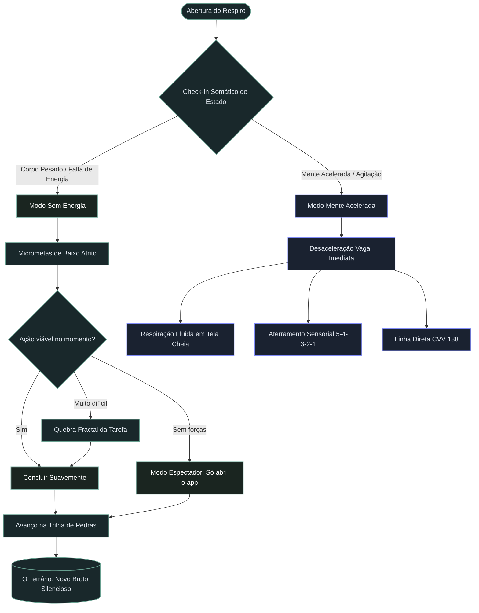
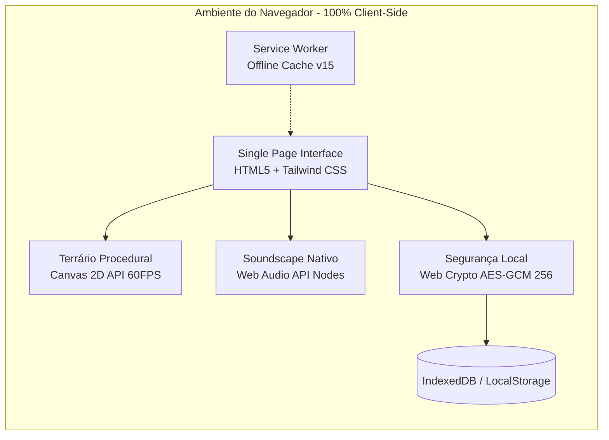

# 🌿 Respiro

### Ativação Comportamental Adaptativa & Neuroergonomia Sensorial
**Uma Single Page Application (PWA) 100% offline-first, privada e acolhedora, desenhada para momentos de sobrecarga mental, depressão profunda e ansiedade.**

 

  

 

  

👉 **[Clique aqui para experimentar o Respiro no seu navegador](https://owelton.github.io/Respiro/)**

 

*“Seu valor não diminui com o seu cansaço.”*

---

## 🧭 Sobre o Projeto

A maioria dos aplicativos de produtividade e hábitos foi desenhada para pessoas com alta energia executiva. Eles usam **notificações invasivas**, **contadores de ofensiva (streaks) punitivos** e **metas irreais** que geram culpa e paralisia quando a pessoa está enfrentando episódios depressivos ou crises de ansiedade.

O **Respiro** propõe uma inversão completa:
- **Zero cobrança ou culpa:** O app nunca cobra se você passar dias sem abri-lo. Não há calendários com buracos vermelhos.
- **Microativação fractal:** Tarefas atômicas (como *"beber um gole d'água"* ou *"soltar os ombros"*). Se ainda assim for difícil, o app quebra a ação em uma versão ainda mais suave.
- **Adaptação Somática Dual:**
  - **Modo Sem Energia (Hipoativação / Depressão):** Ritmo brando, conservação de energia e quebra gradual da inércia.
  - **Modo Mente Acelerada (Hiperativação / Ansiedade):** Desaceleração simpática, estímulo vagal, respiração cadenciada e ancoragem física imediata.
- **Privacidade Radical (Local-Only):** Nenhum dado sai do seu aparelho. Sem login obrigatório, sem servidores externos, com opção de criptografia local AES-GCM de 256 bits via PIN.

---

## 📊 Paradigma: Produtividade Punitiva vs. Respiro

| Característica | Apps Tradicionais de Hábitos | O Respiro |
| :--- | :--- | :--- |
| **Mecânica de Dias Parados** | Streaks quebram $\rightarrow$ frustração e culpa | **Trilha de Pedras**: cada passo é um marco eterno |
| **Reação ao Cansaço** | Alertas urgentes e notificações push | **Modo Espectador**: *"Só abri o app hoje"* já é uma vitória |
| **Volume Sensorial** | Cores saturadas, sons estridentes, pop-ups | **Estímulo Zero**: tipografia sutil, luz zenital e silêncio |
| **Paisagem Sonora** | Arquivos MP3 pesados ou streaming externo | **Síntese Algorítmica**: Web Audio API pura sem tráfego |
| **Privacidade** | Coleta de telemetria e login na nuvem | **100% no Dispositivo**: IndexedDB + Web Crypto local |

---

## 🏛️ Fluxo de Ativação Comportamental

O gráfico abaixo ilustra como o motor do Respiro processa os estados fisiológicos e orienta a pessoa com suavidade:

---

## ✨ Recursos de Destaque

### 1. 🪟 Ergonomia Sensorial & Design Zenital
- **Curvaturas Contínuas (Squircle):** Harmonia geométrica aninhada (`rounded-3xl` externo com `rounded-xl` interno).
- **Luz Zenital (`.zenith-card`):** Bordas com gradiente fosco mineral translúcido (`rgba(255, 255, 255, 0.07)`), proporcionando alívio visual em quartos escuros.
- **Modo Estímulo Zero:** Um botão para ocultar qualquer componente secundário, deixando na tela apenas uma frase suave e duas escolhas.
- **Tipografia Display Maternada:** Família serifada *Fraunces* com tracking negativo e entrelinhas relaxadas em cinza mineral cálido (`#a1a1aa`), eliminando o branco agressivo.

### 2. 🌱 O Terrário Vivo Procedural (HTML5 Canvas)
- **Simulação Circadiana em Tempo Real:**
  - **Dia:** Raios solares filtrados pelas folhagens (*god rays* dourados e esmeraldas).
  - **Crepúsculo:** Luz horizontal âmbar e atmosfera morna de desaceleração.
  - **Noite:** Penumbra suave, reflexos prateados e vaga-lumes bioluminescentes pulsando harmonicamente.
- **Interação Contemplativa:** Brisa suave reativa ao movimento do cursor/toque (*leaf sway*), auréolas de luz translúcida e gotas de orvalho que caem com física suave e microvibração háptica.
- **Coleção Silenciosa:** Elementos como *Ramo de Alfazema*, *Pedra de Rio*, *Cogumelo Luminescente*, *Folha de Ginkgo*, *Broto de Sálvia* e *Cristal de Orvalho*.

### 3. 🌧️ Soundscape Sintetizado Nativamente (Web Audio API)
Zero dependência de arquivos de áudio externos ou conexão de rede:
- **Ruído Marrom Puro:** Filtragem de ruído branco para alívio neurovegetativo e cancelamento de sobrecarga sonora.
- **Chuva Mansa:** Filtros passa-faixa estocásticos que mimetizam gotas d'água caindo em folhas.
- **Brisa Noturna:** Modulação de baixa frequência (LFO de 0.15Hz) criando ondulações de ar suave.

### 4. 🫁 Guia de Respiração Descompressiva (Tela Cheia)
- Interface desprovida de cronômetros regressivos ou números indutores de ansiedade.
- Expansão e contração de um círculo amplo orgânico acompanhado de halos de luz difusa para ancorar a atenção no corpo.
- Toque em qualquer lugar da tela para fechar instantaneamente.

### 5. 🛡️ Segurança, Criptografia & Terapia
- **Criptografia AES-GCM (256 bits):** Proteção ponta a ponta dos seus registros através da Web Crypto API do próprio navegador.
- **Relatório de Apoio para Sessão de Terapia:** Gerador de relatório formatado para impressão ou PDF com médias de humor, nível de conservação de energia e âncoras de alívio, facilitando o diálogo com psicólogos e psiquiatras.
- **Exportação Rápida de Cartão do Dia:** Formatação limpa em texto pronto para enviar via WhatsApp para familiares ou terapeutas.

---

## 🛠️ Arquitetura Técnica

- **Linguagens:** HTML5 semântico, Modern JavaScript (ES6+ modular e reativo) e Tailwind CSS.
- **PWA Ready:** Manifest configurado, ícone vetorial adaptativo e Service Worker com estratégia *Cache-First* garantindo execução completa sem internet.
- **Dependências Externas:** Zero frameworks pesados (sem React, Vue ou Angular). Carregamento instantâneo de ~0.3s.

---

## 📲 Como Instalar e Usar no Celular (PWA)

1. **[Abra o Respiro no celular](https://owelton.github.io/Respiro/)** pelo navegador (Safari no iPhone ou Chrome no Android).
2. **Adicione à tela de início:**
   - **No Android (Chrome):** Toque no menu de três pontos $\rightarrow$ **"Instalar aplicativo"** ou **"Adicionar à tela inicial"**.
   - **No iPhone (Safari):** Toque no botão de **Compartilhar** (ícone com seta para cima) $\rightarrow$ **"Adicionar à Tela de Início"**.
3. O ícone do **Respiro** aparecerá na sua tela inicial e passará a funcionar **100% offline**, com carregamento imediato e suporte a gestos nativos.

---

## 🔒 Direitos Autorais & Propriedade Intelectual

**Copyright © 2026 Welton Moreira. Todos os direitos reservados.**

Este projeto e seu código-fonte são de criação autoral e intelectual exclusiva de **Welton Moreira**.

- 🚫 **Uso Comercial Estritamente Proibido:** É vedada qualquer utilização, reprodução, comercialização, revenda ou apropriação deste software ou de qualquer fração de seu código por empresas, startups, instituições ou terceiros.
- 🚫 **Proibida a Distribuição e Venda:** Não é permitida a criação de versões derivadas com fins lucrativos ou a incorporação deste código em outros produtos ou serviços.
- 👁️ **Finalidade Exclusiva:** O código é disponibilizado publicamente neste repositório exclusivamente para apreciação técnica, consulta e exibição de portfólio autoral.

> **Nota de Cuidado:** O Respiro é uma ferramenta de apoio neuroergonômico e ativação comportamental, mas **não substitui** acompanhamento médico ou psicoterapêutico profissional. Se estiver em sofrimento agudo no Brasil, ligue gratuitamente para o **Centro de Valorização da Vida (CVV)** pelo número **188** ou acesse [cvv.org.br](https://www.cvv.org.br).
